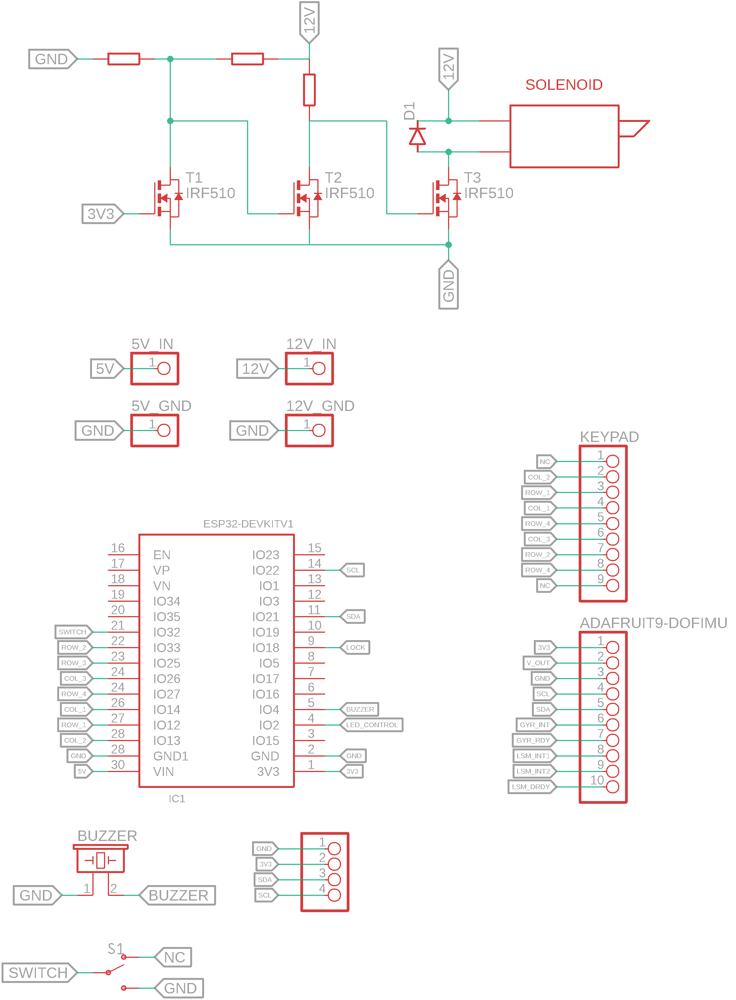
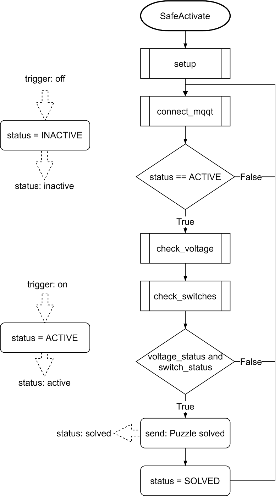

# Team Safe and Puzzles

## Protocol to control leds and piezo via mqtt

## Motivation:
The Players are told to steal the Prototype from the Lab. The Prototype will be locked in the safe.

## General Idea:
After Entering the Lab Room the safe will be deactivated (red LED light). The players first have to supply the safe with power by solving a puzzle (see section puzzle).
This action will change the light color of the safes LED to orange and activate the second puzzle. This puzzle will ultimately open the safe to give access to the prototype.

## Puzzles:
### Puzzle to activate the safe: 
* Switching levers in correct position
* Find the correct resistor to generate the correct voltage
		

### Puzzle to open the safe:
* Riddle with numpad input
		

## toDO
- [ ] Safe Decoration

## Partlist

**part**|**count**|**price/part in €**|**price total**|**link**
:-----:|:-----:|:-----:|:-----:|:-----:
Keypad|1|5,8|5,8|https://octopart.com/3845-adafruit+industries-94636475?r=sp&s=QRIaZTRmSZu4F2mVarnONA
Schloss|1|13,35|13,35|https://octopart.com/1512-adafruit+industries-51880349?r=sp&s=Jx9Gw6qzSH2-PR3HbMgn8w
Banana Plug|20|2,06|41,2|https://octopart.com/1325-2-pomona+electronics-55397240?r=sp&s=kmyIgsMeQOCZjpt9e\_rAXw
Banana Socket|10|1,84|18,4|https://octopart.com/bu-00233-0-mueller-824050?r=sp&s=FBVoi6XFSGGoTvQtIDogQw
Piezo Buzzer|5|1,03|5,15|https://octopart.com/mckpt-g1711a3-05-3691-multicomp-12157125?r=sp&s=TdKAcML0QkSYqrwuZLE5lQ
Schalter|8|2,17|17,36|https://octopart.com/100sp1t1b4m2qe-e-switch-1058620?r=sp&s=26ppMzJ4SaadG3iCrhg9HA
NFC reader|1|8,87|8,87|https://octopart.com/x-nucleo-nfc02a1-stmicroelectronics-70699572?r=sp&s=peYAeYkaRWujJzuYnoxYPw
NFC card|1|2,23|2,23|https://octopart.com/359-adafruit+industries-32978551?r=sp&s=lryNYeLIQsKm1gFRcf293w
N-MOS|10|0,7|7|https://octopart.com/irf510pbf-vishay-46532502?r=sp&s=Ft8oBWb7Tw--a\_FmfUap9w#
Vibration Sensor|1|5,31|5,31|https://octopart.com/1005939-1-te+connectivity-58282477?r=sp&s=jvRt9ds0TKG3iLuzTRHAzw
Switches|2|1,81|3,62|https://octopart.com/db1c-b1lb-zf-71118816?r=sp&s=sDTxIuqxSJOc-Uf9S2HFEg

Total: 128,29 €

## Group

Markus Schwörer, Florian Bregler, Frank Mutter

## Protocol to control leds and piezo via mqtt

standart JSON message on topic 5/safe/control with data = "x:y". x is color and y is the mode.

Colors (x):
* LED_COLOR_WHITE 0
* LED_COLOR_RED 1
* LED_COLOR_GREEN 2
* LED_COLOR_BLUE  3
* LED_COLOR_ORANGE 4

Mode (y):
* LED_MODE_ON 0
* LED_MODE_OFF 1
* LED_MODE_PULSE 2
* LED_MODE_BLINK 3
* LED_MODE_PIEZO 9

For LED_MODE_PIEZO the color parameter is the time of the buzzer sound in seconds.

examples:
* "{\"method\": \"trigger\", \"state\": \"on\", \"data\": \"3:0\" }"
=> Turns blue LEDs on.
* "{\"method\": \"trigger\", \"state\": \"on\", \"data\": \"4:3\" }"
=> LEDs orange blinking.
* "{\"method\": \"trigger\", \"state\": \"on\", \"data\": \"5:9\" }"
=> Buzzer sound for 5 seconds (max value: 9)

## Schematics

# Safe Activate

# Safe Control

## Flow Charts

# Safe Activate

## Instructions for the Escape Room Operator